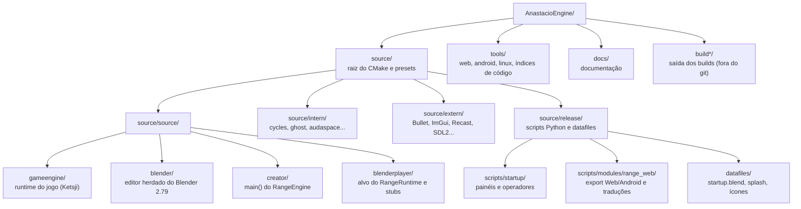
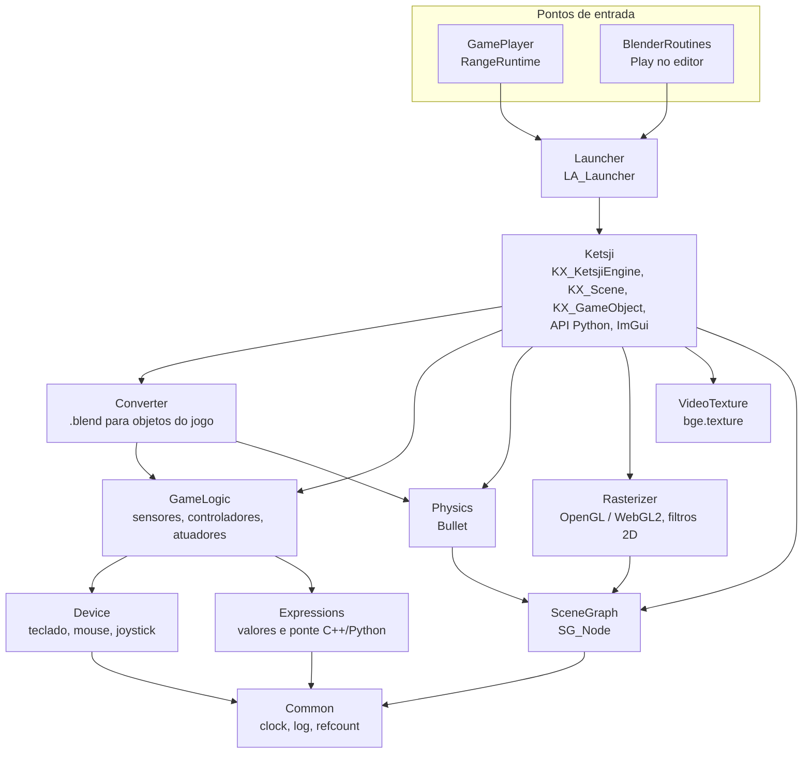
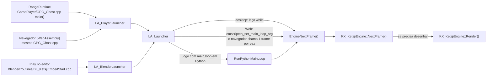
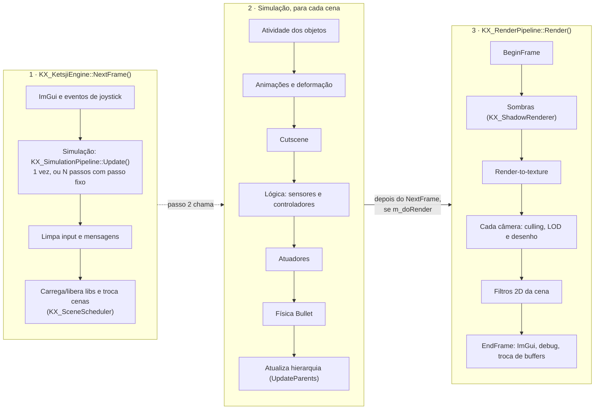
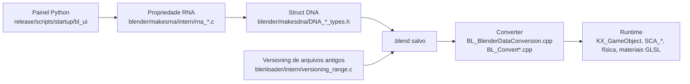
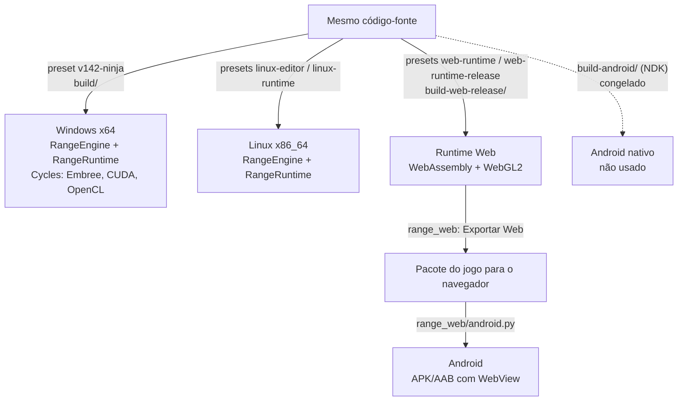

# Diagramas da arquitetura

Visão desenhada da AnastacioEngine, para quem chega ao projeto. O texto completo está em
[architecture.md](architecture.md); este arquivo só desenha. Conferido com o código em 2026-09-26.

Os diagramas usam Mermaid e aparecem desenhados no GitHub. Caminhos de código são relativos a
`source/source/gameengine/`, salvo indicação.

---

## 1. Mapa do repositório

**Legenda.** O jogo roda a partir de `gameengine/`; o editor é o Blender 2.79 modificado (`blender/`). Os dois
executáveis são `RangeEngine` (editor, `main()` em `creator/`) e `RangeRuntime` (player, montado em
`blenderplayer/`). A interface do editor é quase toda Python, em `source/release/scripts/`.

---

## 2. Módulos do runtime

**Legenda.** Setas mostram quem usa quem na arquitetura pensada: de cima (aplicação) para baixo (base).
**Ressalva:** no código real os `#include` cruzam camadas em quase todas as direções (até `Common` inclui
`Expressions` e `SceneGraph`, e `Rasterizer` inclui `Ketsji`), herança do BGE. Use o diagrama para entender
papéis, não como regra de dependência garantida. Tabela de módulos em [architecture.md](architecture.md#módulos-sourcesourcegameengine).

---

## 3. Pontos de entrada até o loop do jogo

**Legenda.** Os três caminhos acabam no mesmo `LA_Launcher::EngineNextFrame()`
(`Launcher/LA_Launcher.cpp`). A diferença da Web é só quem chama cada frame: o navegador, não um `while`.
O Android é um APK com WebView que carrega o pacote Web, então entra pelo caminho do navegador.

---

## 4. Um frame do jogo

**Legenda.** `NextFrame()` sempre roda a simulação; o render só acontece quando `m_doRender` é verdadeiro
(senão o motor só calcula quanto dormir). A hierarquia de objetos é atualizada várias vezes no frame (depois
da lógica, dos atuadores e da física); o diagrama resume. Código: `Ketsji/KX_KetsjiEngine.cpp`,
`Ketsji/KX_SimulationPipeline.cpp`, `Ketsji/KX_RenderPipeline.cpp`.

---

## 5. Do editor para o jogo

**Legenda.** O jogo nunca lê o editor, só o `.blend`. Uma opção nova de jogo costuma tocar todas essas
caixas; a lista exata por tipo de mudança está em [maintenance-guide.md](maintenance-guide.md). Coisas só do
editor (Asset Browser, pastas do Outliner, temas) param antes do conversor.

---

## 6. Plataformas e builds

**Legenda.** Windows e Linux compilam editor e player nativos. A Web compila só o runtime; o jogo é exportado
pelo editor e empacotado com ele. O Android oficial reaproveita o pacote Web dentro de um app com WebView.
Nomes e estado de cada pasta de build: [build-dirs.md](build-dirs.md).
