# Novidades da versão 0.4.7

Prints da interface da engine (a UI é em inglês; as legendas, em português).

## Viewport e interface

### Viewport com camadas e controles de jogo
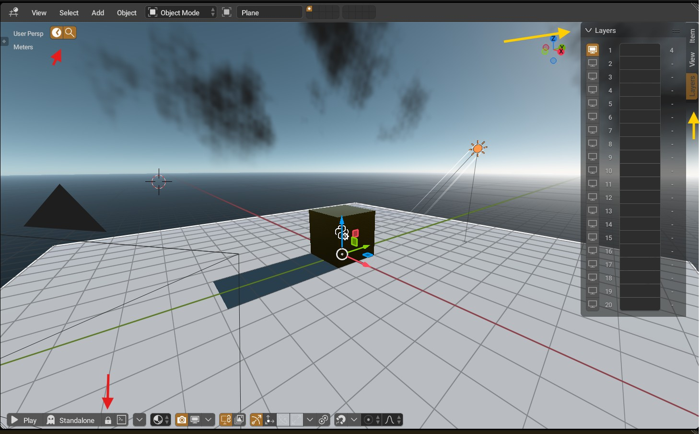

### Menu do cabeçalho com controles de debug flutuantes
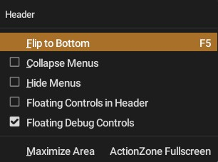

### Outliner com menu de coleções
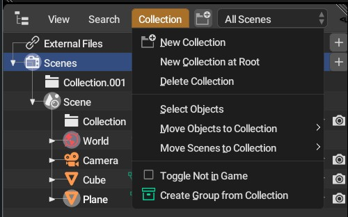

### Preferências: ícones no estilo Blender 5
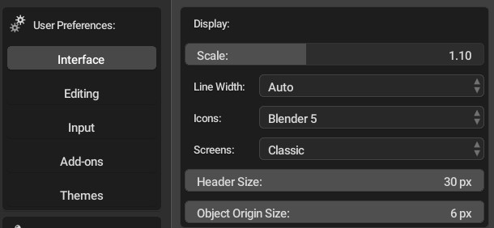

### Preferências: idiomas da interface, com português do Brasil
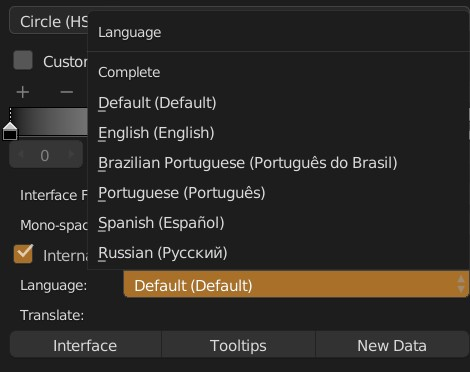

## Render e materiais

### Shading com nós PBR e carregamento rápido de shader
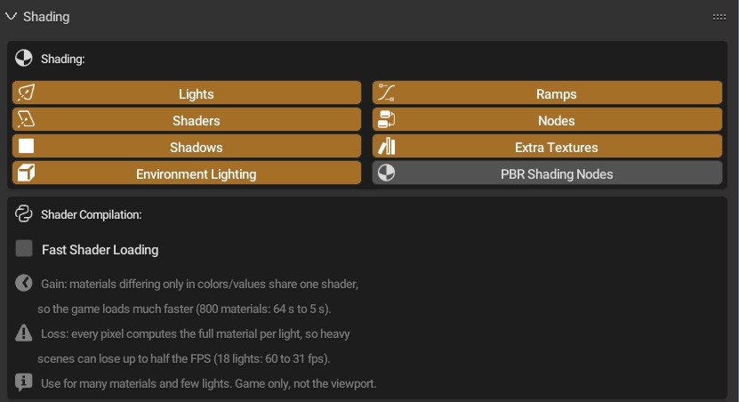

### Converter material clássico para nós PBR
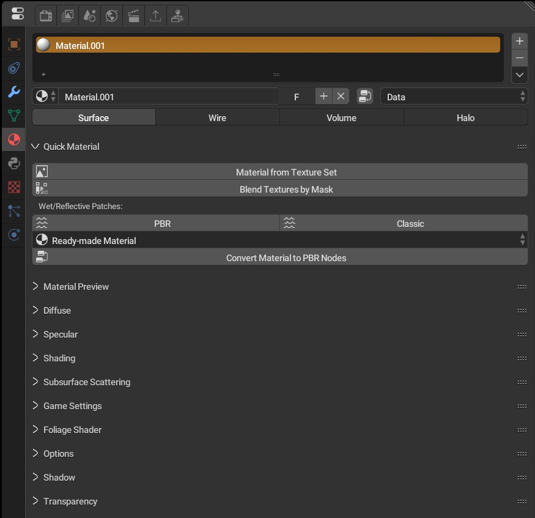

### Resolução dinâmica, vsync, HDR e enquadramento
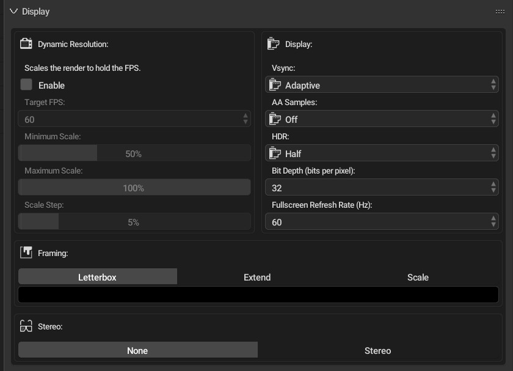

### Efeitos de clima no mundo (névoa, chuva, nuvens, lens flare, terremoto)
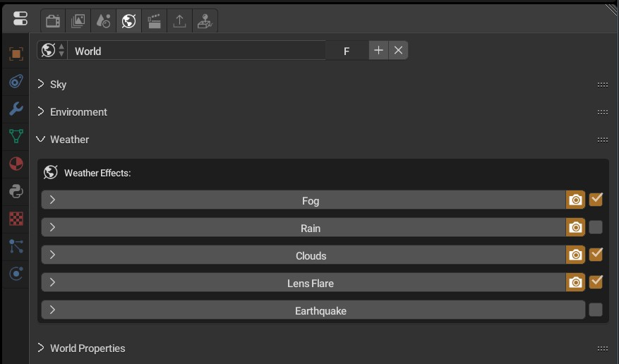

### Partículas de GPU com vórtice/cone tornado
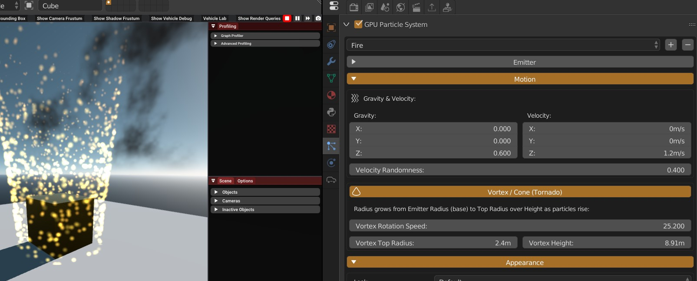

## Jogo e lógica

### Converter bricks de lógica para Python
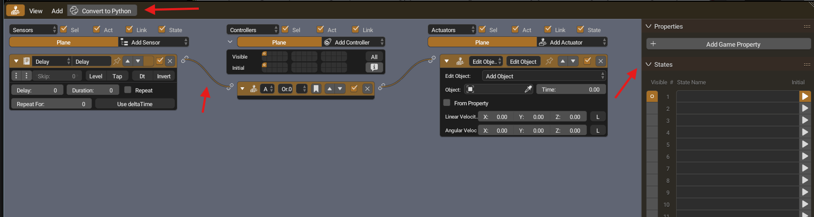

### Rede e componentes do objeto
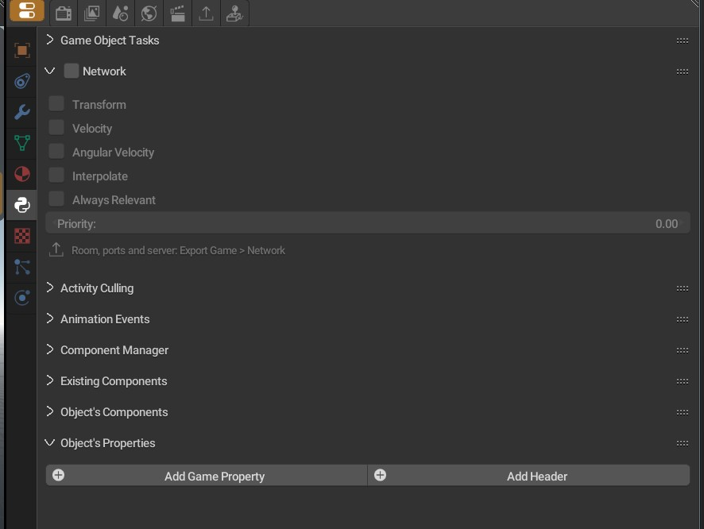

### Sistema, anexos de render e animações
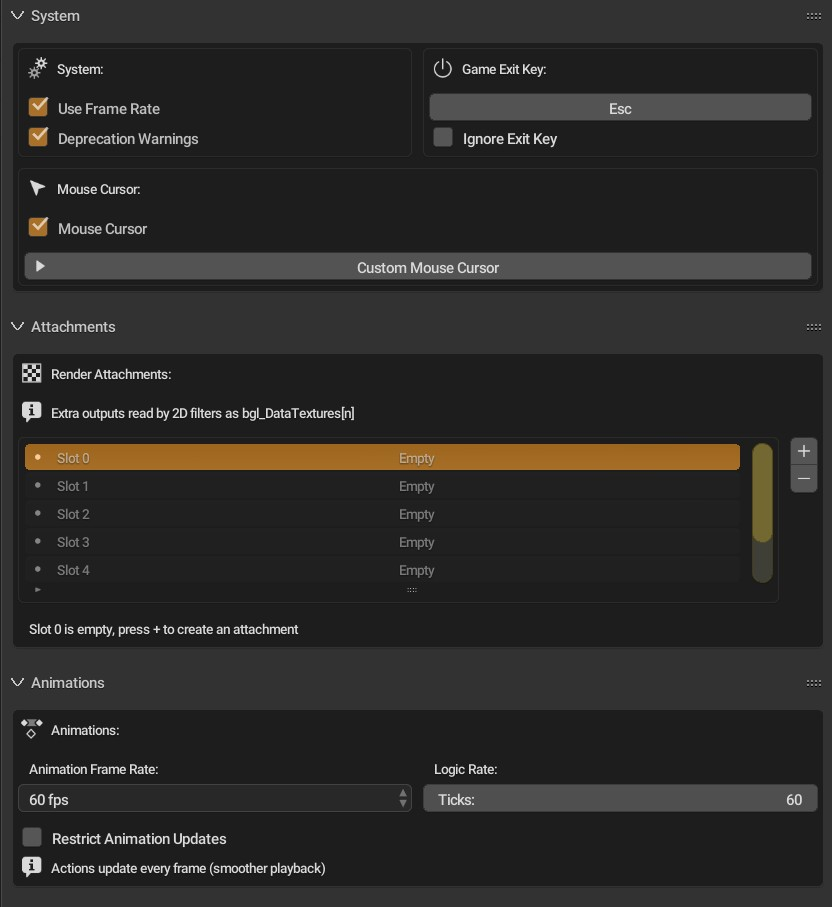

### Player embutido e standalone
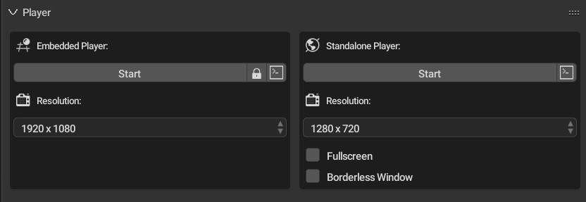

## Plataformas

### Exportação para Web e Android
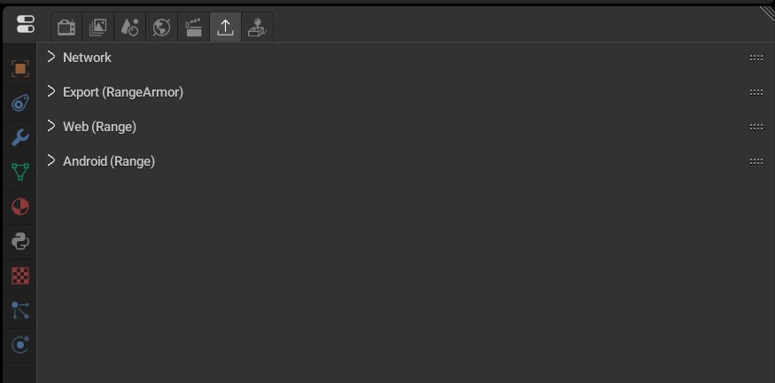

### VR: preparar cena, separação ocular e head tracking
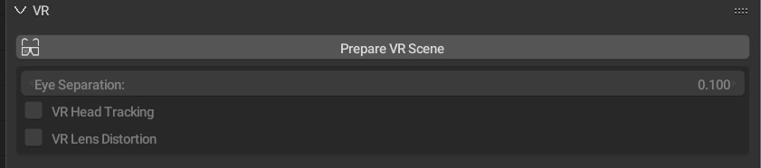
